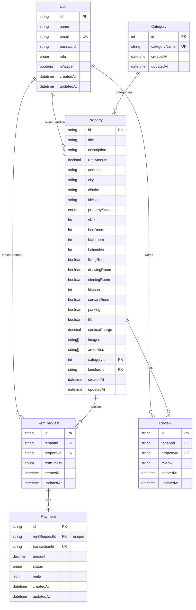

# RENT_NEST_SERVER

## 🎯Project Overview

Rent_Nest is a backend API for a rental property marketplace. Landlords can list properties, manage availability, and approve or reject rental requests. Tenants can browse listings, submit rental requests. Landlord will accept the request then tenant has to pay the **1st month rent**. After successfully complete the payment , tenant can review . Admins oversee the entire platform, managing users and moderating content.

### 🚀Live URL : https://rent-nest-b7-a4.vercel.app/

## Roles & Permissions

| Role         | Description                         | Key Permissions                                                        |
| ------------ | ----------------------------------- | ---------------------------------------------------------------------- |
| **Tenant**   | Users looking for rental properties | Browse listings, submit rental requests, leave reviews, manage profile |
| **Landlord** | Property owners who list rentals    | Create/manage listings, approve/reject requests, view tenant history   |
| **Admin**    | Platform moderators                 | Manage all users, oversee all listings & requests, manage categories   |

## Tech Stack

### Backend

| Technology        | Purpose        |
| ----------------- | -------------- |
| Node.js + Express | REST API       |
| TypeScript        | Type Safety    |
| Postgres + Prisma | Database + ORM |
| JWT               | Authentication |

### Payment Gateway : SSLCOMMERZ

#### Deployment : Vercel for Backend API deployment

## Features

### Public Features

- Browse all available rental properties
- Search and filter by available property, location, price range, property type, and amenities
- View detailed property listings

### Tenant Features

- Register and login as tenant
- Submit rental requests for properties
- **Make payments via SSLCommerz after rental request is approved**
- **View payment history and payment status**
- View rental request history (pending, approved, rejected)
- Leave reviews after a completed rental
- Manage profile

### Landlord Features

- Register and login as landlord
- Create, edit, and remove property listings
- Set property availability status
- Approve or reject rental requests
- View rental history and tenant reviews

### Admin Features

- View all users (tenants and landlords)
- Manage user status (ban/unban)
- View all listings and rental requests
- Manage property categories

## 🗄️ Database Schema Design

This project uses **PostgreSQL** with **Prisma ORM**. Below is the Entity-Relationship Diagram (ERD) representing the core data models.



### 📋 Models Overview

| Model           | Description                                           | Key Relations                                                                       |
| --------------- | ----------------------------------------------------- | ----------------------------------------------------------------------------------- |
| **User**        | Handles admin, landlords & tenants (role-based)       | Admin control, landlord makes Properties, tenant makes RentRequests, writes Reviews |
| **Category**    | Property category/type (e.g. Apartment, House)        | One-to-many with Property                                                           |
| **Property**    | Core listing data — location, rooms, amenities, price | Belongs to Category & Landlord                                                      |
| **RentRequest** | Tenant's request to rent a property                   | Belongs to User (tenant) & Property                                                 |
| **Payment**     | Payment info tied to a rent request                   | One-to-one with RentRequest                                                         |
| **Review**      | Tenant reviews for a property                         | Unique per (tenant, property) pair                                                  |

### 🔑 Key Design Notes

- `User.role` (`LANDLORD` / `TENANT` / `ADMIN`) controls access via role-based middleware.
- `Review` has a `@@unique([tenantId, propertyId])` constraint — one review per tenant per property.
- `Payment` is linked `1:1` with `RentRequest` via a unique foreign key.
- Cascade deletes (`onDelete: Cascade`) ensure referential integrity across relations.

## 🔌 API Endpoints

> 📬 **Postman Collection:** [Rent Nest API Collection](https://drive.google.com/file/d/1u1aNDzWns00T_U9vfU0PzfpTRmrOqi3A/view)
>
> 🌐 **Base URL:** `https://rent-nest-b7-a4.vercel.app/api`

### 🔐 Authentication

| Method | Endpoint              | Description                            | Access        |
| ------ | --------------------- | -------------------------------------- | ------------- |
| POST   | `/auth/register`      | Register a new user                    | Public        |
| POST   | `/auth/login`         | Login and receive access/refresh token | Public        |
| POST   | `/auth/refresh-token` | Generate new access token              | Public        |
| GET    | `/auth/me`            | Get current logged-in user's data      | Authenticated |

### 🏷️ Categories

| Method | Endpoint                        | Description                    | Access |
| ------ | ------------------------------- | ------------------------------ | ------ |
| POST   | `/category/create-category`     | Create a new property category | Admin  |
| GET    | `/category/all-categories`      | Get all categories             | Public |
| PUT    | `/category/update-category/:id` | Update a category              | Admin  |
| DELETE | `/category/delete-category/:id` | Delete a category              | Admin  |

### 🏠 Properties (Public)

| Method | Endpoint          | Description                                                                                                                  | Access |
| ------ | ----------------- | ---------------------------------------------------------------------------------------------------------------------------- | ------ |
| GET    | `/properties`     | Get all properties (supports filters: `location`, `price`, `type`, `propertyStatus`, `page`, `limit`, `sortBy`, `sortOrder`) | Public |
| GET    | `/properties/:id` | Get single property details                                                                                                  | Public |

### 🧑‍💼 Landlord Management

| Method | Endpoint                   | Description                                     | Access   |
| ------ | -------------------------- | ----------------------------------------------- | -------- |
| POST   | `/landlord/properties`     | Create a new property listing                   | Landlord |
| PUT    | `/landlord/properties/:id` | Update own property                             | Landlord |
| DELETE | `/landlord/properties/:id` | Delete own property                             | Landlord |
| GET    | `/landlord/requests`       | Get all rent requests for landlord's properties | Landlord |
| PATCH  | `/landlord/requests/:id`   | Approve or reject a rent request                | Landlord |

### 📄 Rental Requests

| Method | Endpoint                  | Description                            | Access |
| ------ | ------------------------- | -------------------------------------- | ------ |
| POST   | `/rentals?propertyId=:id` | Create a rental request for a property | Tenant |
| GET    | `/rentals`                | Get tenant's all rental requests       | Tenant |
| GET    | `/rentals/:id`            | Get single rental request details      | Tenant |
| GET    | `/rentals/my-rents`       | Get tenant's all rented property       | Tenant |

### 💳 Payments

| Method | Endpoint           | Description                         | Access |
| ------ | ------------------ | ----------------------------------- | ------ |
| POST   | `/payments/create` | Initiate payment for a rent request | Tenant |
| POST   | `/payments`        | verify payment                      | Tenant |
| GET    | `/payments`        | Get tenant's payment history        | Tenant |
| GET    | `/payments/:id`    | Get single payment details          | Tenant |

### ⭐ Reviews

| Method | Endpoint   | Description                 | Access |
| ------ | ---------- | --------------------------- | ------ |
| POST   | `/reviews` | Add a review for a property | Tenant |

### 🛠️ Admin

| Method | Endpoint           | Description                                 | Access |
| ------ | ------------------ | ------------------------------------------- | ------ |
| GET    | `/admin/users`     | Get all users                               | Admin  |
| PATCH  | `/admin/users/:id` | Ban/unban a user (toggle `isActive`)        | Admin  |
| GET    | `/admin/rentals`   | Get all rental requests across the platform | Admin  |

## ⚙️ Setup & Installation

Follow these steps to run the project locally.

### Prerequisites

- [Node.js](https://nodejs.org/)
- [PostgreSQL](https://www.postgresql.org/) (local or hosted, e.g. [Neon](https://neon.tech/))
- pnpm / npm / yarn
- [Git](https://git-scm.com/)

### 1. Clone the Repository

```bash
git clone https://github.com/riday-kumar/rent-nest-server.git
cd rent-nest-server
```

### 2. Install Dependencies

```bash
npm install
```

### 3. Configure Environment Variables

Create a `.env` file in the root directory and add the following:

```env
# Server
PORT=5000
APP_URL=http://localhost:5000

# Database
DATABASE_URL=your_database_url


# JWT
SALT_ROUND=10
ACCESS_SECRET=your_access_token_secret
REFRESH_SECRET=your_refresh_token_secret
ACCESS_EXPIRES_IN=1d
REFRESH_EXPIRES_IN=7d

# Bcrypt
SALT_ROUND=10

#SSLCOMMERZE
SSL_COMMERZE_STORE_ID:your_store_id
SSL_COMMERZE_STORE_PASSWORD:your_store_password
SSL_COMMERZE_SUCCESS_URL:your_success_url
SSL_COMMERZE_FAIL_URL:your_fail_id
SSL_COMMERZE_CANCEL_URL:your_cancel_id
```

### 4. Run Prisma Migrations

Generate the Prisma client and push the schema to your database:

```bash
npx prisma generate
npx prisma migrate dev --name init
```

(Optional) Open Prisma Studio to view your database visually:

```bash
npx prisma studio
```

### 5. Run the Development Server

```bash
npm run dev
```

The server will start at: http://localhost:5000/
